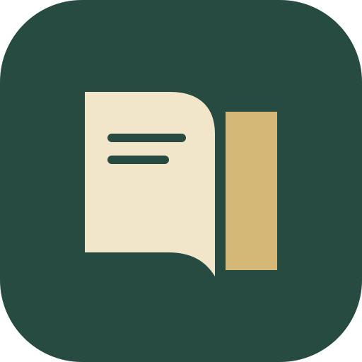

<div align="center">



# 页间 · Pagewise

**翻开书，留一点时间给思考。**

面向教材学习的 Windows 本地 PDF 阅读器。把进度、标注和笔记留在自己的电脑里。

[下载安装](https://github.com/Danny731/pagewise/releases/latest) · [使用指南](docs/USER_GUIDE.md) · [开发文档](docs/DEVELOPMENT.md) · [迭代路线图](docs/ROADMAP.md) · [更新记录](CHANGELOG.md)

</div>


## 为什么做页间

读教材时，经常要在章节、习题和答案之间来回跳转，也需要记住进度和整理笔记。页间把这些操作放到一个独立桌面窗口中，安装后可离线使用，无需登录，也不需要上传 PDF。

## 当前功能

| 场景     | 功能                                                         |
| -------- | ------------------------------------------------------------ |
| 继续学习 | 本地书架、最近阅读、页内位置恢复、按文档指纹关联已有资料     |
| 舒适阅读 | 连续滚动、单页、双页、缩放、旋转、全屏、深浅色界面           |
| 查找内容 | PDF 目录、缩略图、书签、文本搜索、教材印刷页码校准、跳转历史 |
| 对照学习 | 同一 PDF 的两个独立阅读位置，各自翻页和缩放                  |
| 记录思考 | 文字高亮、区域框选、页笔记、标注附注、Markdown 笔记导出      |
| 保存资料 | SQLite 本地保存、JSON 备份与合并恢复，保留原 PDF             |


## 自动生成教材目录

没有内置目录时，点击左侧「生成目录」，可从书里的印刷目录或正文标题生成可折叠、可搜索的目录树。支持指定目录页、核对正文位置、修改标题/层级/页码，以及手动补充条目。

生成结果先作为草稿供试跳核对，保存后随书库保留；重新生成不会直接覆盖原目录，替换后可以恢复上一版。已有文字层的扫描件可尝试自动生成；纯图片扫描件可手动建目录，OCR 引擎尚未加入。


## 下载与运行

在 [GitHub Releases](https://github.com/Danny731/pagewise/releases) 下载 **v0.2.1**。私有仓库下载需要有访问权限的 GitHub 账号。

| 文件                           | 用途                                   |
| ------------------------------ | -------------------------------------- |
| `Pagewise_0.2.1_x64-setup.exe` | Windows x64 安装程序                   |
| `Pagewise.exe`                 | 直接运行；资料仍保存在用户应用数据目录 |
| `Pagewise-docs-v0.2.1.zip`     | 使用说明、开发文档和截图               |
| `SHA256SUMS.txt`               | 发布文件的 SHA-256 校验值              |

目标平台为 **Windows 10 / 11 x64**，运行需要 Microsoft Edge WebView2 Runtime。开发和验证在 Windows 上完成，暂未验证 macOS、Linux 或 ARM64 构建。

打开应用后，点击「打开本地 PDF」或拖入文件；也可点击「体验示例教材」查看八页原创示例。安装版会注册 PDF 打开方式，是否设为默认阅读器由你自行选择。

## 三分钟上手

1. 打开教材，通过左侧目录、缩略图或页码框跳转。
2. 点击「高亮」并拖选文字；扫描件和图表可使用「框选」。
3. 打开右侧笔记面板，为当前页或已有标注添加想法。
4. 点击「分屏对照」，将右侧切到答案或参考章节。
5. 关闭前确认左下角显示「阅读资料已保存」，之后从书架继续。

更多操作见 [使用指南](docs/USER_GUIDE.md)。

## 本地数据

- 桌面资料位于 `%APPDATA%\com.pagewise.reader\pagewise.sqlite`。
- 原 PDF 保留在原位置，不会被应用改写或上传。
- JSON 备份包含进度、书签、标注和文件路径，**不包含 PDF 原文件**。
- 文件移动或改名后，重新打开同一份 PDF，可按文档指纹关联资料。
- 浏览器开发预览使用独立的 localStorage / IndexedDB，不与桌面版共享数据。

## 从源码运行

准备 Node.js 24、Rust stable、Microsoft C++ Build Tools 的「使用 C++ 的桌面开发」组件和 WebView2 Runtime，然后运行：

```powershell
git clone https://github.com/Danny731/pagewise.git
cd pagewise
npm ci
npm run desktop
```

构建 Windows 安装包：

```powershell
npm run package
```

程序位于 `src-tauri/target/release/pagewise.exe`，安装包位于 `src-tauri/target/release/bundle/nsis/`。环境配置、测试和发布步骤见 [开发文档](docs/DEVELOPMENT.md)。

## 技术结构

采用 Tauri 2、React、TypeScript、PDF.js 和 SQLite。页面画布按需渲染，标注使用 PDF 坐标保存，文件操作和数据库读写由 Rust 桌面层处理。

实现和数据格式见 [架构说明](docs/ARCHITECTURE.md)，依赖归属见 [第三方说明](THIRD_PARTY_NOTICES.md)。

v0.2.0 已实现文字版自动目录，实现范围与后续 OCR 计划见 [自动目录说明](docs/AUTO_TOC_DESIGN.md)。

## 验证与当前限制

v0.2.1 已通过 19 项模型与识别算法测试、10 项浏览器端到端场景，覆盖阅读、搜索、分屏、标注、备份模型、中文 PDF、混合页面尺寸、旋转以及 500 页文件的进度恢复。端到端测试运行在浏览器开发预览；桌面层另验证了中文文件读取、SQLite 保存和正常关闭。

- 单个 PDF 上限 **512 MB**；文件整体读入，画布按可见区域创建和回收。
- 无文字层的扫描件可阅读和框选，尚不支持 OCR、文字搜索或文字高亮。
- 标注保存在应用数据库，暂不写回通用 PDF 批注格式。
- 暂无 PDF 正文编辑、手写、打印、云同步和 AI 问答。
- 页码校准使用全书固定偏移；复杂分节编号可使用 PDF 内置页码标签。
- 500 页验证使用程序生成的文件，不代表所有图像密集或复杂教材的性能。

可在 [Issues](https://github.com/Danny731/pagewise/issues) 记录版本、操作步骤和 PDF 类型，无需上传私人教材或阅读数据库。
